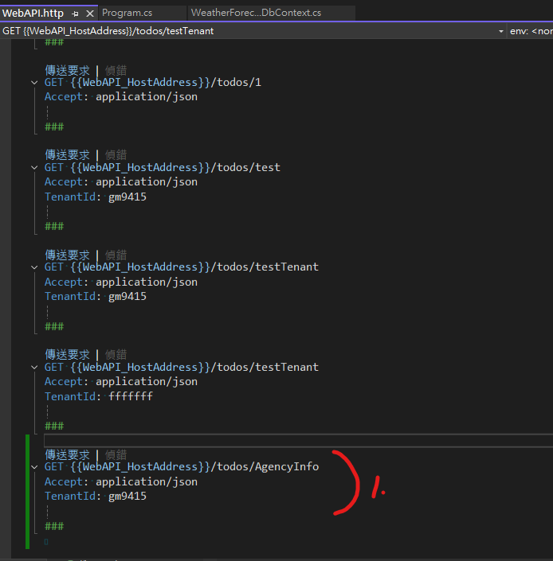

# 多租戶資料庫

目錄：

- [多租戶資料庫](#多租戶資料庫)
  - [租戶身分擷取](#租戶身分擷取)
    - [建立Expansion的類別庫](#建立expansion的類別庫)
    - [Nuget中安裝Request資訊擷取](#nuget中安裝request資訊擷取)
    - [Expansion類別庫中添加Request擷取服務的功能](#expansion類別庫中添加request擷取服務的功能)
    - [WebAPI增加參考Expansion類別庫](#webapi增加參考expansion類別庫)
    - [WebAPI中登錄Request資訊擷取的服務](#webapi中登錄request資訊擷取的服務)
  - [資料庫上下文切換](#資料庫上下文切換)
    - [Nuget中安裝資料庫存取工具](#nuget中安裝資料庫存取工具)
    - [Expansion類別庫中添加基於EntityFrameworkCore建置的DbContext工廠](#expansion類別庫中添加基於entityframeworkcore建置的dbcontext工廠)
    - [WebAPI專案中登錄DbContext工廠服務](#webapi專案中登錄dbcontext工廠服務)
    - [測試存取租戶資料庫](#測試存取租戶資料庫)
  - [鷹架工程](#鷹架工程)
    - [安裝鷹架工程工具](#安裝鷹架工程工具)
    - [於偵錯模式將WebAPI專案的終端機開啟](#於偵錯模式將webapi專案的終端機開啟)
    - [取得租戶資料庫的連線字串](#取得租戶資料庫的連線字串)
    - [使用EFCore的鷹架工程工具還原資料模型](#使用efcore的鷹架工程工具還原資料模型)
    - [整理生成的DbContext並將原本的DbContext刪除](#整理生成的dbcontext並將原本的dbcontext刪除)
    - [測試存取租戶資料庫中的機構資訊](#測試存取租戶資料庫中的機構資訊)

## 租戶身分擷取

### 建立Expansion的類別庫


> 使用 .net 9.0

### Nuget中安裝Request資訊擷取

- Request資訊擷取
  - Nuget 安裝`Microsoft.AspNetCore.Http`


### Expansion類別庫中添加Request擷取服務的功能


> 移除預設的檔案Class1.cs

### WebAPI增加參考Expansion類別庫


<!-- omit from toc -->
#### 確認為同方案中的`Expansion`專案


### WebAPI中登錄Request資訊擷取的服務

1. 登錄至`Program.cs`的Build服務中
2. 建立 Web API 端點供驗證
3. `WebAPI.http`中增加簡易測試的 Web Client設定
4. 執行偵錯


<!-- omit from toc -->
#### 於偵錯模式中，執行`WebAPI.http`傳送要求，確認有從DI注入中取得`Headers.TenantId`資訊


## 資料庫上下文切換

依照`隱含設定`選擇[資料庫存取](../README.md#資料庫存取)

### Nuget中安裝資料庫存取工具

- 資料庫存取工具
  - Nuget 安裝`Microsoft.EntityFrameworkCore.Relational`(關聯式資料庫工具，含`ADO.NET`)
    - Object Relational Mapping (ORM、物件關聯對映) 存取資料庫`Microsoft.EntityFrameworkCore`
    - 服務組態讀取`Microsoft.Extensions.Configuration.Abstractions`


<!-- omit from toc -->
#### 確認作者跟依賴項目均有


### Expansion類別庫中添加基於EntityFrameworkCore建置的DbContext工廠

- 增加透過租戶身分，取得組態中，對應的資料庫連線字串
- `DbContext`工廠
  - 基於租戶身分，`DbContext`工廠建置符合的`DbContext`


### WebAPI專案中登錄DbContext工廠服務

由於[原生 AOT 與 EF Core不兼容](../README.md#原生aot與efcore不兼容)，登錄前要先將其停用

1. **`Fix`**[停用NativeAOT編譯](../停用NativeAOT編譯.md)
2. 依`隱含設定`選擇[`資料庫服務`提供者](../README.md#資料庫服務)，對應的存取工具安裝
   - Nuget 安裝`Npgsql.EntityFrameworkCore.PostgreSQL`
3. 建置DbContext
4. 登錄至`Program.cs`的Build服務中


<!-- omit from toc -->
#### 建置DbContext


<!-- omit from toc -->
#### 登錄至`Program.cs`的Build服務中


### 測試存取租戶資料庫


<!-- omit from toc -->
#### 在`WebAPI.http`建立測試的Request，於偵錯模式中，執行`WebAPI.http`傳送要求


<!-- omit from toc -->
##### 確認`WebAPI.http`執行結果為true


<!-- omit from toc -->
##### 在`WebAPI.http`建立[不存在的租戶](README.md#多租戶資料庫)的測試Request，確認`WebAPI.http`執行結果為false


## 鷹架工程

為了方便讀取資料庫中的 Seed Data，使用偵錯模式建立的仿真環境，透過鷹架供成還原出資料表結構，依照`隱含設定`[資料庫存取-ORM](../README.md#資料庫存取)

### 安裝鷹架工程工具

- 鷹架工程工具
  - Nuget 安裝`Microsoft.EntityFrameworkCore.Design`


<!-- omit from toc -->
#### 確認作者是微軟，安裝後重建WebAPI專案


### 於偵錯模式將WebAPI專案的終端機開啟


<!-- omit from toc -->
#### 確認終端機的資料夾路徑，是WebAPI的專案路徑


### 取得租戶資料庫的連線字串


<!-- omit from toc -->
#### 從監控頁面取得WebAPI的組態

將其複製到剪貼簿中


### 使用EFCore的鷹架工程工具還原資料模型

1. 使用剪貼簿中的連線字串，取代下列命令的`$connectionString`參數值
2. 在偵錯模式中的WebAPI專案的終端機，使用修改號的命令列

```powershell
# 覆蓋參數
$connectionString="Host=localhost;Port=56315;Username=postgres;Password=Se.gE67Zyc}zzsca)!T{tq;Database=a0ac"
dotnet ef dbcontext scaffold $connectionString Npgsql.EntityFrameworkCore.PostgreSQL --output-dir ./Data/Model --context-dir ./Data/Context -c WeatherForecastDbContext --use-database-names --data-annotations --no-onconfiguring --no-build --table hr010 
```

<!-- omit from toc -->
#### 確認有生成Model跟DbContext

- ./Data
  - /Model/WeatherForecastDbContext.cs
  - /Context/hr010.cs


### 整理生成的DbContext並將原本的DbContext刪除

- 進`./Data/Model/WeatherForecastDbContext.cs`
  - ~~刪除21~24行~~，針對資料庫連線的建構`protected override void OnConfiguring(DbContextOptionsBuilder optionsBuilder)`
  > 可省略。[指令](#使用efcore的鷹架工程工具還原資料模型)已增加`--no-onconfiguring`避免產生`protected override void OnConfiguring(DbContextOptionsBuilder optionsBuilder)`，但還需確認避免工具版本差異
- 刪除`./Data/WeatherForecastDbContext.cs`
- 清理用不到的using


<!-- omit from toc -->
#### 確認整理後的結果


### 測試存取租戶資料庫中的機構資訊


<!-- omit from toc -->
#### 在`WebAPI.http`建立取得機構資訊的測試Request



<!-- omit from toc -->
#### 確認`WebAPI.http`執行結果


