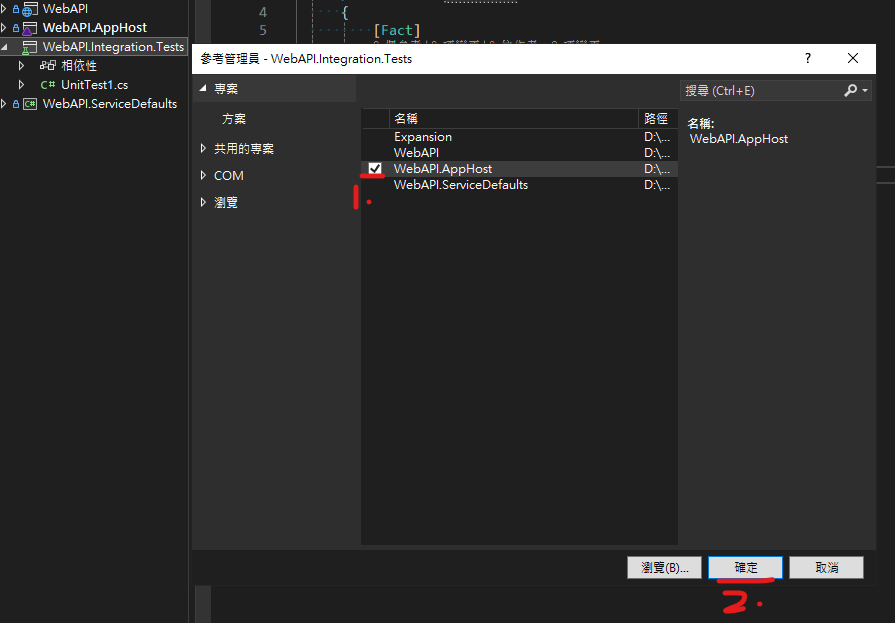

# 自動化整合性測試

目錄：

- [自動化整合性測試](#自動化整合性測試)
  - [方案增加自動化測試專案](#方案增加自動化測試專案)
    - [建立整合測試專案並加入方案](#建立整合測試專案並加入方案)
    - [使用xUnit做為測試框架](#使用xunit做為測試框架)
    - [設定測試專案名跟路徑](#設定測試專案名跟路徑)
    - [選擇框架版本](#選擇框架版本)
    - [安裝Aspire的整合測試工具](#安裝aspire的整合測試工具)
    - [整合測試專案參考既有的編排專案](#整合測試專案參考既有的編排專案)
  - [單例測試](#單例測試)
    - [測試總管中執行單例測試](#測試總管中執行單例測試)
  - [多例測試](#多例測試)
    - [測試總管中執行多例測試並確認測試結果](#測試總管中執行多例測試並確認測試結果)
  - [編排生命週期](#編排生命週期)
    - [新增測試中的採集固定功能](#新增測試中的採集固定功能)
    - [修改多例測試引用測試中的採集固定功能](#修改多例測試引用測試中的採集固定功能)

## 方案增加自動化測試專案

### 建立整合測試專案並加入方案

### 使用xUnit做為測試框架

### 設定測試專案名跟路徑

### 選擇框架版本

<!-- omit from toc -->
#### 驗證產生的檔案

### 安裝Aspire的整合測試工具

- 專案`WebAPI.Integration.Tests`安裝Aspire的整合測試工具
  - Nuget 安裝`Aspire.Hosting.Testing`

<!-- omit from toc -->
#### 搜尋並確認版本，按下安裝

<!-- omit from toc -->
#### 確認作者是微軟，才點選我接受

### 整合測試專案參考既有的編排專案

<!-- omit from toc -->
#### 參考編排(Aspire)的專案`WebAPI.AppHost`

## 單例測試

1. 修改檔案名稱
2. 使用微軟提供的測試泛例
3. 15行改寫成自己的編排專案名稱`Projects.WebAPI_AppHost`
4. 28行改寫成要測試對象，於編排中定義的專案名稱`webapi`
   1. 33行改寫成測試對象提供的接口路徑`/todas`

### 測試總管中執行單例測試

<!-- omit from toc -->
#### 從工具列中開啟測試總管

<!-- omit from toc -->
#### 測試總管中找到並執行測試

<!-- omit from toc -->
#### 會建置且自動執行偵錯，確認是否組建完成

<!-- omit from toc -->
#### 確認執行測試中，docker是否有自動運行資料庫服務

<!-- omit from toc -->
##### 確認單例測試結果是否成功

## 多例測試

1. 新增檔案
2. 依照微軟`IAsyncLifetime`範例，改寫檔案
3. 取得測試對象各家的測試資料
4. 將測試資料給`GetWebResourceRootReturns`使用

### 測試總管中執行多例測試並確認測試結果

> 總時 10.5秒

<!-- omit from toc -->
#### 再次執行，並觀察測試過程，每組參數都會重建環境

## 編排生命週期

由於多例測試中，會不斷地重建執行個體，在不影響結果的測試中，屬於浪費效能

### 新增測試中的採集固定功能

> Collection Fixtures (採集固定) 功能是測試框架 xUnit 提供的，如用其他框架則要自行研究作法

### 修改多例測試引用測試中的採集固定功能

<!-- omit from toc -->
#### 確認執行結果，總時是否有降低

> 總時從 10.5秒，降為 3.8秒
